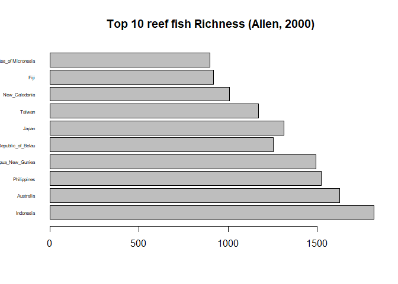

R_assignment_0923
================
he-ping
2024-09-23

Download reef_fish.xlsx, save it in a working directory you dedicated
for this course, and import it in R. Do the same after converting this
reef_fish file into a .txt format

## Reading the file

``` r
# importing a .xlsx file
library(readxl)
fish<-read_excel("C:/Users/peace/Downloads/reef_fish.xlsx") # store my table in an object called `fish`
fish # print my object `fish` 
```

    ## # A tibble: 10 × 2
    ##    country                        richness
    ##    <chr>                             <dbl>
    ##  1 Indonesia                          1820
    ##  2 Australia                          1627
    ##  3 Philippines                        1525
    ##  4 Papua_New_Guniea                   1494
    ##  5 Republic_of_Belau                  1254
    ##  6 Japan                              1315
    ##  7 Taiwan                             1172
    ##  8 New_Caledonia                      1007
    ##  9 Fiji                                919
    ## 10 Federated_States_of Micronesia      900

``` r
# importing a .txt file
fish_table <-read.table("C:/Users/peace/Downloads/reef_fish.txt", header=T, sep='\t', dec='.') 
fish
```

    ## # A tibble: 10 × 2
    ##    country                        richness
    ##    <chr>                             <dbl>
    ##  1 Indonesia                          1820
    ##  2 Australia                          1627
    ##  3 Philippines                        1525
    ##  4 Papua_New_Guniea                   1494
    ##  5 Republic_of_Belau                  1254
    ##  6 Japan                              1315
    ##  7 Taiwan                             1172
    ##  8 New_Caledonia                      1007
    ##  9 Fiji                                919
    ## 10 Federated_States_of Micronesia      900

## Including Plots

import data set and create an object in R studio + simple plot

``` r
fish<-read.table("C:/Users/peace/Downloads/reef_fish.txt", header=T, sep='\t', dec='.')
barplot(fish$richness, main="Top 10 reef fish Richness (Allen, 2000)", horiz=TRUE, names.arg=fish$country, cex.names=0.5, las=1) 
```

<!-- -->

Note that the `echo = FALSE` parameter was added to the code chunk to
prevent printing of the R code that generated the plot.
